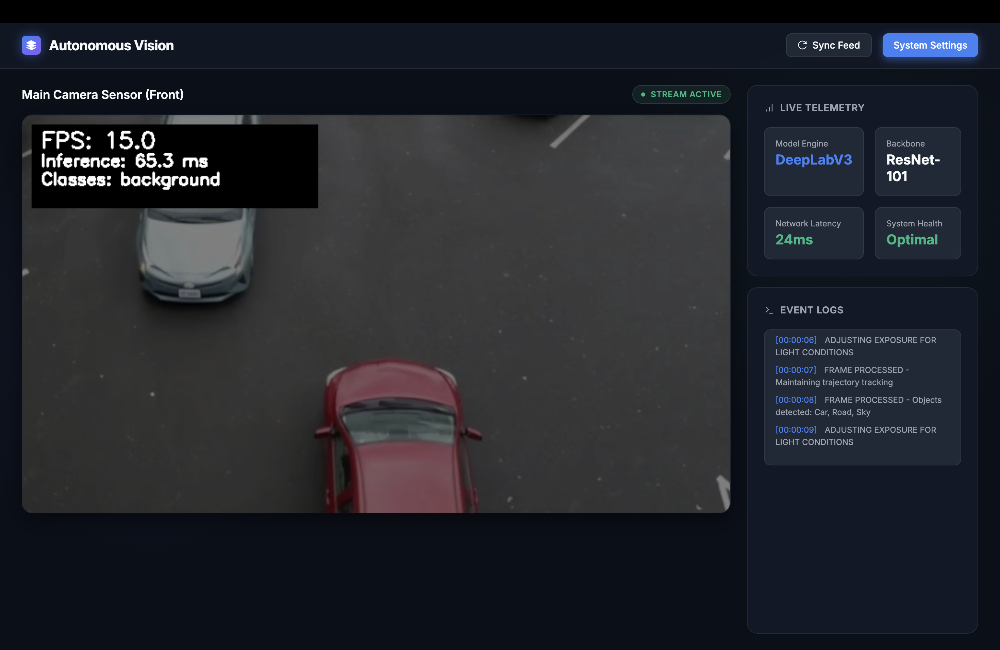

# Self-Driving Vision Web App


## Creator
## Prince Maurya

---

### Project Description
This project demonstrates real-time semantic scene segmentation on video, simulating how autonomous vehicles perceive their environment. It has been transformed into a **Modern Web Application**! It uses a high-performance `MobileNet-V3` backend optimized for Apple Silicon (MPS) and CUDA to classify every pixel in each video frame. It streams a real-time feed with colored segmentation masks directly to a highly professional, dark-mode browser dashboard.

### Features
- **Real-time Web Streaming**: Streams AI-processed video directly to your browser via Flask.
- **Modern Dashboard UI**: Sleek, glassmorphic dark-theme interface with simulated live telemetry and event logs.
- **Hardware Acceleration**: Automatically utilizes MPS (Apple Silicon) or CUDA (NVIDIA GPUs) for fast real-time inference.
- **Per-Pixel Segmentation**: Uses MobileNet-V3 for lightning-fast perception.
- Colored overlays for each class (e.g., road, sky, trees, people, cars, buildings).

---

### File Structure

```
project/
├── app.py                  # Flask Web Server entry point
├── templates/
│   └── index.html          # Modern Dashboard UI (HTML/CSS)
├── main.py                 # (Legacy) CLI entry point
├── segmentation_model.py   # Loads AI model (MobileNet-V3) and runs segmentation
├── video_processor.py      # Handles video streaming (generate_frames) and processing
├── utils/
│   ├── color_map.py        # Color mapping for segmentation classes
│   └── fps_counter.py      # FPS calculation utility
├── requirements.txt        # Python dependencies
├── dashboard.png           # UI Screenshot
└── README.md               # Project documentation
```

---

### How to Run

1. Clone the repository and navigate into it.
2. Install dependencies (we recommend using a virtual environment):
	```bash
	python3 -m venv venv
	source venv/bin/activate
	pip install -r requirements.txt
	```
3. Place a sample driving video named `input_video.mp4` in the root directory.
4. Run the Flask Server:
	```bash
	python app.py
	```
5. Open your Chrome browser and navigate to:
    **http://localhost:5001**

---

### Notes
- Ensure you have a valid `input_video.mp4` file before running the server.
- The first time you run it, the PyTorch model weights (~40MB) will be downloaded automatically.
